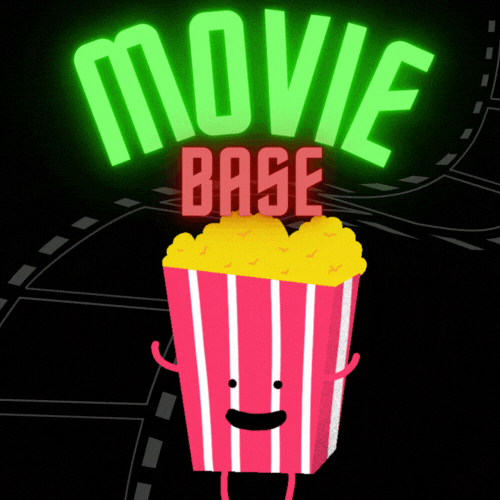

# Movie Database Project

## Project Overview
This project is a simple movie database web application that is built using Django. It allows users to signup and view a list of movies, see detailed information about each movie, and add new movies to the database. Users can also rate movies and leave comments.

## Installation
To install and run this project, follow these steps:

1. Clone the repository: `git clone https://github.com/SoroushGReza/movies-database.git`
2. Navigate to the project directory: `cd movies-database`
3. Install the required packages: `pip3 install -r requirements.txt`
4. Run the server: `python3 manage.py runserver`

## Features
- **Movie List**: Users can view a list of all movies in the database.
- **Movie Detail**: Users can click on a movie to see more detailed information.
- **Add Movie**: Users can add a new movie to the database.

## User Stories

### The following user stories is left Todo / Under Progress:

- As a **User** I can **Log in to my account**, so that **I can access my personal settings and features**.
- As a **User** I can **View and Edit my Profile**, so that **I can manage my personal information**.
- As a **User** I can **search for movie titles**, so that **I can quickly find the movies I'm looking for**.
- As a **User** I can **Sort movies by different criteria**, so that **I can view the movies in the order best suited for me**.
- As a **User** I can **Write reviews for movies**, so that **I can share my thoughts and opinions about the movie**.
- As a **User** I can **Rate movies**, so that **I can express my level of enjoyment or dissapointment**.
- As an **Admin** I can **Add, Edit, and Delete movies**, so that **I can manage the movie database**.
- As an **Admin** I can **Manage User Accounts**, so that **I can ensure the integrity and safety of the users**.
- As a **Developer** I can **Make a README.md file**, so that **I can gradually add content to it during development**.

### The following user stories is done:

- As a **Developer** I can **set up the project environment**, so that **I have a structured workspace to start developing**.
- As a **Developer** I can **Create basic Models for Movie and Genre**, so that **I can store and manage movie and genre data in database**.
- As a **Developer** I can **Create basic Views and Templates for movie list and movie detail, so that users can view a list of movies and the details of  movie**.
- As a **Developer** I can **Implement URL routing, so that users can navigate by using URLs**.
- As a **Developer** I can *Create a form for adding a new movie, so that movie data can be collected and save to database**.
- As a **Developer** I can **Create a GIF-logo**, so that **I can use it in my README.md**
- As a **User** I can **Register for an account**, so that I can **have a personlized experience and access to features for members**.

## Future Improvements
Future improvements for this project include:

## Credits
